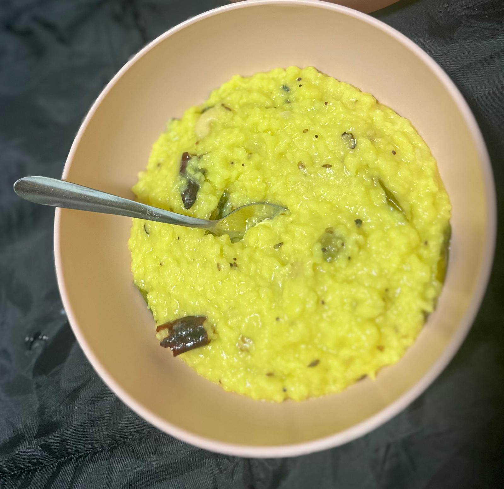

## Bhavani Kongari

My favorite dish is Pongal, which is a popular South-Indian dish made from rice, flavored with ghee, pepper, cumin etc. It's a comforting, wholesome meal with a savory taste, perfect for any time of the day. Pongal is often prepared during the Pongal, an Indian festival, to celebrate the harvest season.  

